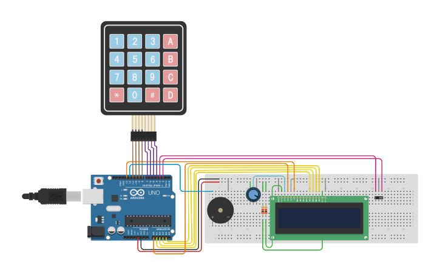

# AVR Chess Clock - Embedded System

This repository contains the source code and documentation for the **AVR Chess Clock** project. The device was designed and implemented as the final coursework for the **Microprocessor Techniques 1** (Techniki Mikroprocesorowe 1) course at AGH University of Krakow.

## Project Description

The primary objective of this project is to demonstrate the practical application of low-level embedded programming in C (Bare-Metal), specifically focusing on direct register manipulation, hardware timers, and interrupt handling on the ATmega328P microcontroller. The system functions as a precise, dual-timer chess clock with a custom user interface.

The codebase covers:
* **Hardware Interfacing:** Custom drivers for a 16x2 LCD display (4-bit mode) and a 4x4 Matrix Keypad, implemented without external libraries.
* **Interrupt-Driven Logic:** Utilization of 16-bit Timer1 (CTC Mode) and `TIMER1_COMPA_vect` interrupts for precise, non-blocking timekeeping.
* **Direct Port Manipulation:** High-speed I/O control using `DDRx`, `PORTx`, and `PINx` registers.
* **State Management:** Implementation of game logic including mode selection (Test, Blitz, Rapid) and turn switching.

## Repository Structure

The repository is organized to separate the source code from documentation and schematics:

* **`src/`**: Contains the main application source code implemented in C.
    * **`main.c`**: The core implementation file containing the `main()` loop, LCD driver functions, keypad scanning algorithm, and interrupt service routines.

* **`docs/`**: Project documentation and hardware diagrams.
    * `circuit_diagram.png`: Schematic illustrating the connections between the MCU, LCD, Keypad, and Buzzer.

## Hardware Architecture

The project is built based on the ATmega328P microcontroller (Arduino Uno platform).

</br>
*Above: Connection diagram for the Chess Clock system.*

### Pin Mapping
* **LCD (Port C):** Data lines (PC0-PC3), RS (PC4), EN (PC5).
* **Keypad (Port D):** Rows (PD0-PD3), Columns (PD4-PD7).
* **Buzzer (Port B):** Signal Output (PB0).

## Dependencies & Toolchain

The project is written in standard C99 for AVR microcontrollers and requires the AVR-GCC toolchain.

* **Compiler:** `avr-gcc`
* **Programmer:** `avrdude`
* **Standard Libraries:** `<avr/io.h>`, `<avr/interrupt.h>`, `<util/delay.h>`

## Usage Instructions

To deploy the application to your hardware, follow these steps:

1.  **Clone the repository:**
    ```bash
    git clone [https://github.com/BeneNat/avr-chess-clock.git](https://github.com/BeneNat/avr-chess-clock.git)
    cd avr-chess-clock
    ```

2.  **Compile the Code:**
    Navigate to the `src` directory and compile using `avr-gcc`.
    ```bash
    cd src
    avr-gcc -Os -DF_CPU=16000000UL -mmcu=atmega328p -c -o main.o main.c
    avr-gcc -mmcu=atmega328p main.o -o main.elf
    avr-objcopy -O ihex -R .eeprom main.elf main.hex
    ```

3.  **Flash the Microcontroller:**
    Upload the compiled `.hex` file using `avrdude` (adjust the port `/dev/ttyACM0` or `COM3` as needed).
    ```bash
    avrdude -F -V -c arduino -p ATMEGA328P -P /dev/ttyACM0 -b 115200 -U flash:w:main.hex
    ```

## Author and Context

* **Author:** Filip Żurek
* **Institution:** AGH University of Krakow
* **Faculty:** Faculty of Computer Science, Electronics and Telecommunications
* **Field of Study:** Electronics and Telecommunications
* **Course:** Microprocessor Techniques 1

## License
This software is distributed under the MIT License. Refer to the [LICENSE](LICENSE) file for the full text.

---
AGH University of Krakow - Microprocessor Techniques Project 2025